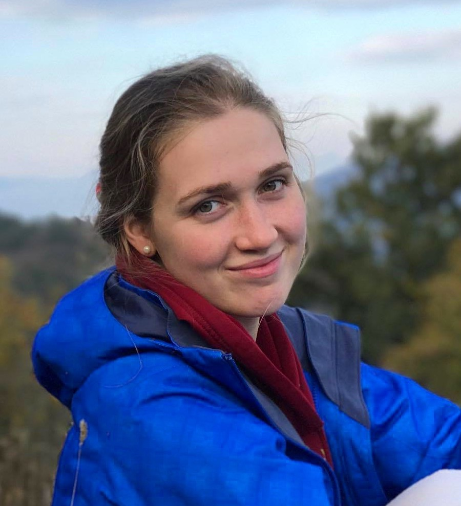

## About Me

Hi! I am a PhD Student in Geophysics at Harvard University, advised by Dr. Marine Denolle. My current research focus lies in using ambient noise seismology to better understand and quantify ground motion amplification in sedimentary basins. I am particularly interested in how the seismic wavefield behaves at the basin edge, which I am now investigating in Seattle, especially the Seattle thrust fault, the Seattle basin's southern boundary.

## Research Interest

My current research focus lies in using ambient noise seismology to better understand and quantify ground motion amplification in sedimentary basins, Seattle in particular.

## Publications

1. F.Bar, J.Doe: Effects of having a placeholder of a name

## Typography

This is a [link](http://google.com). Something *italics* and something **bold**.

    #Here is a table

Year | Award | Category
-----|-------|--------
2014 | Emmy  | Won Outstanding Lead Actor in a miniseries or a movie
2015 | BAFTA | Nominated for Best Leading Actor for Sherlock
2014 | Satellite | Won Best Actor miniseries or television film

    ##Here is a horizontal rule

---
quote:

> To a great mind, nothing is little

## References

* Foo Bar: Head of Department, Placeholder Names, Lorem
* John Doe: Associate Professor, Department of Computer Science, Ipsum
