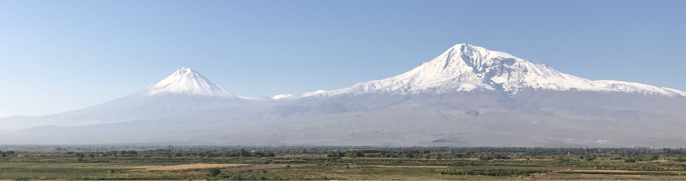

# Natasha Toghramadjian

## About Me

I am a first-year PhD Student in Geophysics at Harvard University, in the [Earthquake Seismology Group](https://quake.fas.harvard.edu/) advised by Dr. Marine Denolle. My research is supported by the [NSF Graduate Research Fellowship](https://www.nsfgrfp.org/) and the [Harvard Ashford Fellowship](https://ashfordfellows.fas.harvard.edu/about).

## space
## space
## space
## space

## Research Interests

 My current research focuses on using ambient noise seismology to better understand and quantify ground motion amplification in sedimentary basins. I am particularly interested in how the seismic wavefield behaves at the basin edge, which I am now investigating in Seattle, especially the Seattle thrust fault, the Seattle basin's southern boundary.

One of our 10 broadband seismic stations and educational exhibits deployed across downtown Seattle in April 2019.

## Publications

1. Lilit Sargsyan, **Natasha E. Toghramadjian**, Alan L. Kafka; Cellular Seismology Analysis of Reservoir‐Triggered Seismicity Associated with Armenian Dams. Bulletin of the Seismological Society of America; 108 (5B): 3126–3140. doi: [https://doi.org/10.1785/0120180014]

---

## Contact

natasha_toghramadjian@g.harvard.edu

Geology Museum 200B
20 Oxford Street
Cambridge, MA 02138
USA