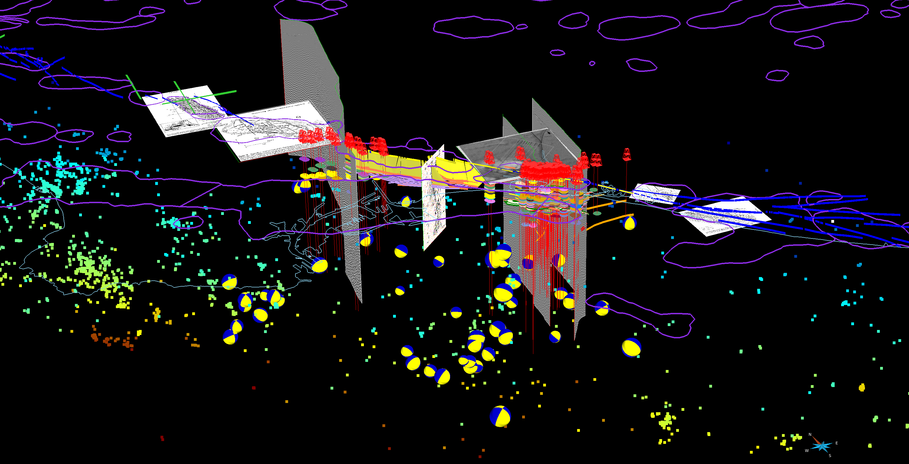
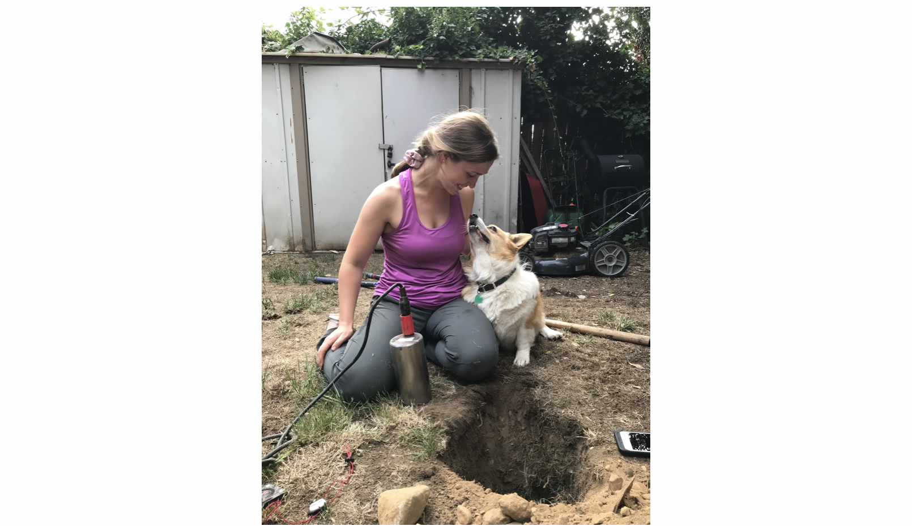

# Natasha Toghramadjian

## About Me

I am a third-year PhD Student in Geophysics and NSF GRFP Fellow in the [Structural Geology & Earth Resources Group](https://https://structure.harvard.edu/) at Harvard University, advised by Professor John H. Shaw.

 My research is supported by the [NSF Graduate Research Fellowship](https://www.nsfgrfp.org/)  and the [Harvard Ashford Fellowship](https://ashfordfellows.fas.harvard.edu/about).

&nbsp;
&nbsp;

&nbsp;

## Research Interests

**New Perspectives on Newport-Inglewood Fault Geometry**

My current research centers on the Newport-Inglewood Fault, a tectonically active right-lateral system that extends for more than 40 km across the Los Angeles basin, California, and last ruptured in the 1933 Mw 6.4 Long Beach earthquake. The fault poses significant seismic hazard to the nearly 20 million people living in the greater LA metropolitan area.

In the absence of robust seismologial data from a recent large earthquake, I leverage numerous diverse, independent data sets&mdash;&mdash;2D and 3D seismic reflection surveys, robust stratigraphic controls from decades of oil industry well records, and hypocenter and focal mechanism catalogs recently expanded through template-matching&mdash;&mdash;to develop 3D fault representations. These data are used as weighted interpolation constraints, following the objective and reproducible method of Riesner et al. (2017).

This work has direct implications for seismic hazard assessments in the Los Angeles metro area and is a key step toward understanding the tectonic history of Southern California.

*A 3D overview of the independent datasets I'm using to both manually construct and objectively interpolate the 3D subsurface geometry of the Newport-Inglewood Fault.*

**Ground motion amplification and crustal tomographic imaging in Seattle**

I have also studied the Seattle sedimentary basin and fault zone, where I've [deployed 100+ broadband and nodal seismometers](https://www.king5.com/article/news/local/researchers-will-install-monitors-to-study-seattle-earthquake-fault-zone/281-ab395842-a46b-4ebf-baeb-0b1b623f7ffb), hosted at schools, churches, small businesses, and family backyards, to measure the ambient noise field. I cross-correlate these signals to investigate earthquake propagation in the basin&mdash;&mdash;which, like other sedimentary basins around the world&mdash;&mdash;is known to trap seismic energy and amplify ground motion during high-magnitude earthquakes. In particular, I am interested in the role played by the basin edges and the Seattle thrust fault.

For large urban communities built atop sedimentary basins, this energy amplification means heightened seismic hazard. We plan to produce improved seismic velocity models and localized ground motion prediction equations, which can be applied by seismic engineers to inform building codes and change policy.

*One of our 10 broadband seismic stations and educational exhibits deployed across downtown Seattle in 2019.*

In addition to the technical aspects of geophysics, I especially enjoy working in the field and connecting my research to local communities. I prioritize engaging with and understanding the human dimension of each project. 

&nbsp;

[//]: # **Ground motion amplification and crustal tomographic imaging**

[//]: # I have also studied the Seattle sedimentary basin and fault zone, where I've [deployed 100+ broadband and nodal seismometers](https://www.king5.com/article/news/local/researchers-will-install-monitors-to-study-seattle-earthquake-fault-zone/281-ab395842-a46b-4ebf-baeb-0b1b623f7ffb), hosted at schools, churches, small businesses, and family backyards, to measure the ambient noise field. I cross-correlate these signals to investigate earthquake propagation in the basin&mdash;&mdash;which, like other sedimentary basins around the world&mdash;&mdash;is known to trap seismic energy and amplify ground motion during high-magnitude earthquakes. In particular, I am interested in the role played by the basin edges and the Seattle thrust fault.

[//]: # For large urban communities built atop sedimentary basins, this energy amplification means heightened seismic hazard. The desire to better understand and address this threat drives my research.

[//]: # We plan to produce improved seismic velocity models and localized ground motion prediction equations, which can be applied by seismic engineers to inform building codes and change policy. In the long-term we hope to help mitigate earthquake risk in cities across the globe by extending our basin edge and fault research beyond Seattle.

[//]: # I've also studied the Seattle basin and fault zone, using ambient noise seismology to investigate how seismic waves are amplified within sedimentary basins and reflected by their edges. 

[//]: # To measure the ambient seismic field, I've  [deployed 100+ broadband and nodal seismometers](https://www.king5.com/article/news/local/researchers-will-install-monitors-to-study-seattle-earthquake-fault-zone/281-ab395842-a46b-4ebf-baeb-0b1b623f7ffb) across the Seattle area, hosting these instruments at schools, churches, small businesses, and family backyards.

[//]: # I cross-correlate ambient noise recordings to investigate earthquake propagation in the basin, which&mdash;&mdash;like other sedimentary basins around the world&mdash;&mdash;is known to trap seismic energy and amplify ground motion during high-magnitude earthquakes. In particular, I am interested in the role played by the basin edges and the Seattle thrust fault.

## Publications

1. Lilit Sargsyan, **Natasha E. Toghramadjian**, Alan L. Kafka; Cellular Seismology Analysis of Reservoir‐Triggered Seismicity Associated with Armenian Dams. Bulletin of the Seismological Society of America; 108 (5B): 3126–3140. doi: [https://doi.org/10.1785/0120180014]

---

[//]: # 

[//]: #                                A helper joined us for field work!

## Contact

natasha_toghramadjian@g.harvard.edu

Geology Museum 200B
 20 Oxford Street
 Cambridge, MA 02138

