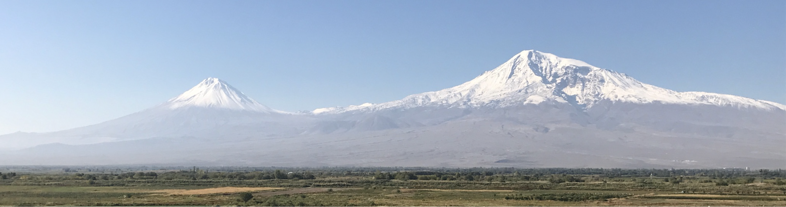
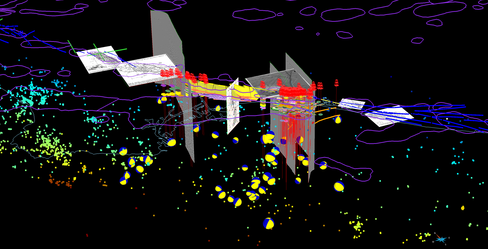
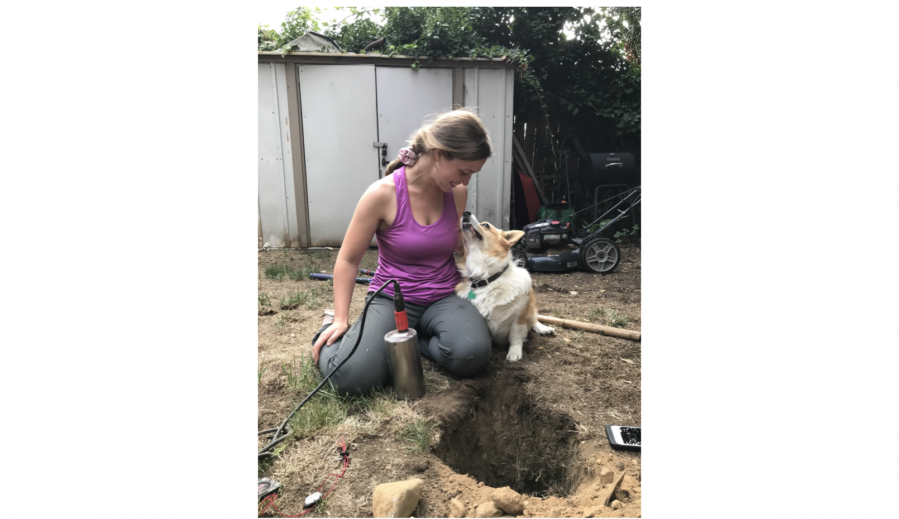

I am a Postdoctoral Fellow in Applied Geophysics & Structural Geology in the [Structural Geology & Earth Resources Group](https://structure.harvard.edu/) at Harvard University, where I also completed my PhD, funded by the [NSF Graduate Research Fellowship](https://www.nsfgrfp.org/).

I am a structural geologist and applied geophysicist specializing in 3D structural modeling. My research integrates diverse geological and geophysical datasets to characterize complex fault systems and subsurface structures, with applications to seismic hazard assessments in urban environments. I especially enjoy working on field deployments and involving local communities. 

Prior to my graduate work, I spent a year in Armenia on a Fulbright Research Grant, studying reservoir-triggered seismicity and the subsurface structure of the Caucasus Mountains, as well as the role scientific collaboration can play in improving international relationships. I received my B.S. in Geological Sciences with a minor in Physics from Boston College.

&nbsp;

*3D view of select datasets we're using to 3D model the Newport-Inglewood fault of Los Angeles, CA.*

&nbsp;
&nbsp;

*One of our 10 broadband seismic stations and educational exhibits deployed across downtown Seattle in 2019.*

&nbsp;

## Select Publications

1. Toghramadjian, N. & Shaw, J. H. Anatomy of a complex strike-slip urban fault system: the Newport–Inglewood fault, Los Angeles, California. Manuscript in preparation.
2. Toghramadjian, N., Denolle, M. A., Ermert, L., & Jiang, C. Probing the Seattle Basin edge using a dense urban nodal array in 100 backyards. Seismological Research Letters (2026).
3. Meliksetian, K., Sargsyan, L., Koulakov, I., Toghramadjian, N., et al. Deep sources of recent volcanism in Armenia inferred from ambient noise tomography. Journal of Geophysical Research: Solid Earth (2026).
4. Toghramadjian, N. & Shaw, J. H. 3D Geometry and Slip Distribution in the Long Beach Earthquake Gate, Newport–Inglewood Fault. Bulletin of the Seismological Society of America 114(4):1941–1965 (2024).
5. Sargsyan, L., Toghramadjian, N. & Kafka, A. Cellular Seismology Analysis of Reservoir-Triggered Seismicity Associated with Armenian Dams. Bull. Seismol. Soc. Am. (2018).

---

[//]: # 

## Contact

natasha_toghramadjian@g.harvard.edu

Geology Museum
 20 Oxford Street
 Cambridge, MA 02138