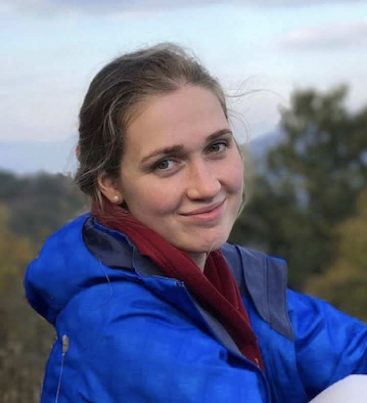

# Natasha Toghramadjian

## About Me

{:height="300px" width="100px"}

I am a second-year PhD Student in Geophysics at Harvard University, advised by Dr. Marine Denolle in the [Earthquake Seismology Group](https://quake.fas.harvard.edu/).

## Research Interests

**Ground motion amplification and crustal tomographic imaging**

 My current research centers on the Seattle sedimentary basin, where I [deploy broadband and nodal seismometers](https://www.king5.com/article/news/local/researchers-will-install-monitors-to-study-seattle-earthquake-fault-zone/281-ab395842-a46b-4ebf-baeb-0b1b623f7ffb) to measure the ambient noise field. I cross-correlate these signals to investigate earthquake propagation in the basin&mdash;&mdash;which, like other sedimentary basins around the world&mdash;&mdash;is known to trap seismic energy and amplify ground motion during high-magnitude earthquakes. In particular, I am interested in the role played by the basin edges and the Seattle thrust fault.

For large urban communities built atop sedimentary basins, this energy amplification means heightened seismic hazard. The desire to better understand and address this threat drives my research.

We plan to produce improved seismic velocity models and localized ground motion prediction equations, which can be applied by seismic engineers to inform building codes and change policy. In the long-term we hope to help mitigate earthquake risk in cities across the globe by extending our basin edge and fault research beyond Seattle.

 My research is supported by the [NSF Graduate Research Fellowship](https://www.nsfgrfp.org/) and the [Harvard Ashford Fellowship](https://ashfordfellows.fas.harvard.edu/about).

One of our 10 broadband seismic stations and educational exhibits deployed across downtown Seattle in 2019.

## Publications

1. Lilit Sargsyan, **Natasha E. Toghramadjian**, Alan L. Kafka; Cellular Seismology Analysis of Reservoir‐Triggered Seismicity Associated with Armenian Dams. Bulletin of the Seismological Society of America; 108 (5B): 3126–3140. doi: [https://doi.org/10.1785/0120180014]

---

## Contact

natasha_toghramadjian@g.harvard.edu

Geology Museum 200B
 20 Oxford Street
 Cambridge, MA 02138

